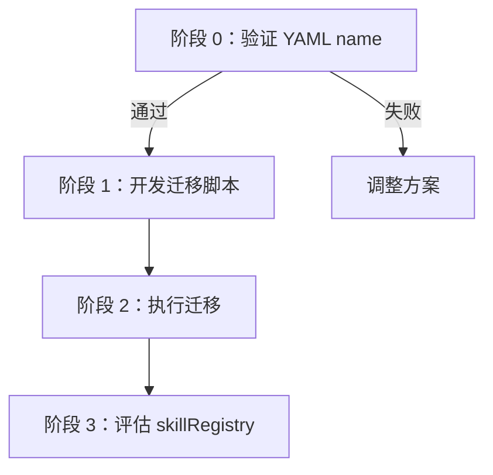

# AB 方案融合实施计划

> 基于已确认的 AB 结合方案（好管理 + 好调用），给出可直接执行的融合路径。

---

## 现状快照

### 当前 15 个 Skill 文件夹名

| # | 当前文件夹名 | 命名风格 |
|---|------------|---------|
| 1 | `01_同步代码仓库_v1.0` | 有编号，版本号不完整（缺 PATCH） |
| 2 | `1对1DWD单表SQL生成` | 无编号，无版本 |
| 3 | `DWD字段信息Excel生成` | 无编号，无版本 |
| 4 | `Doris建表语句查询` | 无编号，无版本 |
| 5 | `ODS-DWD-一键生成` | 无编号，无版本 |
| 6 | `临时数据存储` | 无编号，无版本 |
| 7 | `创建技能` | 无编号，无版本 |
| 8 | `子项目管理` | 无编号，无版本 |
| 9 | `安装技能` | 无编号，无版本 |
| 10 | `数仓生产库查询` | 无编号，无版本 |
| 11 | `框架体检` | 无编号，无版本 |
| 12 | `版本控制备份` | 无编号，无版本 |
| 13 | `记忆管理` | 无编号，无版本 |
| 14 | `课题研究` | 无编号，无版本 |
| 15 | `项目规范化` | 无编号，无版本 |

**结论**：15 个中 14 个无编号无版本，1 个编号和版本不符新规范。全部需要迁移。

### 当前 YAML name 字段

所有 YAML `name` 都等于中文文件夹名（如 `name: 框架体检`），与文件夹名完全一致。

---

## 域分类 & 编号映射表

> 域分类已更新：A = 元技能，B = 系统治理，C = 数仓开发。详见 `03_Skills管理标准_v1.0.0.md`。

### A 域：元技能（2 个）

| 新编号 | 当前文件夹名 | 新文件夹名 | 新 YAML name |
|-------|------------|----------|-------------|
| A01 | `创建技能` | `A01_创建技能` | `A01_创建技能` |
| A02 | `安装技能` | `A02_安装技能` | `A02_安装技能` |

### B 域：系统治理（6 个）

| 新编号 | 当前文件夹名 | 新文件夹名 | 新 YAML name |
|-------|------------|----------|-------------|
| B01 | `框架体检` | `B01_框架体检` | `B01_框架体检` |
| B02 | `版本控制备份` | `B02_版本控制备份` | `B02_版本控制备份` |
| B03 | `记忆管理` | `B03_记忆管理` | `B03_记忆管理` |
| B04 | `子项目管理` | `B04_子项目管理` | `B04_子项目管理` |
| B05 | `课题研究` | `B05_课题研究_v1.0.0` | `B05_课题研究_v1.0.0` |
| B06 | `项目规范化` | `B06_项目规范化` | `B06_项目规范化` |

### C 域：数仓开发（7 个）

| 新编号 | 当前文件夹名 | 新文件夹名 | 新 YAML name |
|-------|------------|----------|-------------|
| C01 | `01_同步代码仓库_v1.0` | `C01_同步代码仓库_v1.0.0` | `C01_同步代码仓库_v1.0.0` |
| C02 | `数仓生产库查询` | `C02_数仓生产库查询` | `C02_数仓生产库查询` |
| C03 | `Doris建表语句查询` | `C03_Doris建表语句查询` | `C03_Doris建表语句查询` |
| C04 | `临时数据存储` | `C04_临时数据存储` | `C04_临时数据存储` |
| C05 | `1对1DWD单表SQL生成` | `C05_1对1DWD单表SQL生成` | `C05_1对1DWD单表SQL生成` |
| C06 | `DWD字段信息Excel生成` | `C06_DWD字段信息Excel生成` | `C06_DWD字段信息Excel生成` |
| C07 | `ODS-DWD-一键生成` | `C07_ODS-DWD-一键生成` | `C07_ODS-DWD-一键生成` |

> 所有版本统一从 v1.0.0 开始（视为新体系的 v1）。

---

## 受影响位置全量清单

通过代码扫描得出的完整引用清单：

### 1. `workspace-spec.json`（SSOT）

| 区域 | 当前值 | 需改为 | 数量 |
|------|-------|-------|------|
| `overwriteLayer.skills` | `"框架体检"` 等 8 个中文名 | `"B01_框架体检"` 等（带版本，与 YAML name 一致） | 8 处 |
| `bomCheck.files` | `.agents/skills/版本控制备份/scripts/backup.ps1` 等 | `.agents/skills/B02_版本控制备份/scripts/backup.ps1` 等 | 7 处 |

**注意**：`bomCheck.files` 路径包含版本号，每次 Skill 版本升级都需要更新。详见 Q&A `03_skillRegistry是什么_v1.0.0.md`。

### 2. `version-control-rules.md`

| 行 | 当前内容 | 需改为 |
|----|---------|-------|
| 第 10 行 | `.agents/skills/版本控制备份/scripts/backup.ps1` | `.agents/skills/B02_版本控制备份/scripts/backup.ps1` |
| 第 72-78 行 | 7 个脚本路径表格 | 全部更新为新路径 |

### 3. SKILL.md 文件内部路径引用

| SKILL.md | 引用路径 | 数量 |
|----------|---------|------|
| `版本控制备份/SKILL.md` | `.agents\skills\版本控制备份\scripts\backup.ps1` | 5 处 |
| `框架体检/SKILL.md` | `.agents\skills\框架体检\scripts\framework-check.ps1` | 1 处 |
| `子项目管理/SKILL.md` | `.agents\skills\子项目管理\scripts\*.ps1` | 5 处 |
| `记忆管理/SKILL.md` | 语义引用（"Skill：版本控制备份"） | 2 处 |

### 4. 脚本内部（`.ps1`）

| 脚本 | 引用 | 影响 |
|------|------|------|
| `backup.ps1` | `.agents\\skills\\` 路径匹配正则 | 正则按模式匹配，不受影响 |
| `framework-check.ps1` | 从 `bomCheck.files` 读取路径 | 自动跟随 workspace-spec，不用改 |

**关键发现**：脚本内部不硬编码其他 Skill 名称，而是通过 `workspace-spec.json` 动态读取。所以**脚本本身不需要改**，只要 `workspace-spec.json` 更新即可。

### 5. direction-rules.md

不包含 Skill 路径引用，**不需要改**。

### 6. memory-rules.md、filename-rules.md

不包含 Skill 路径引用，**不需要改**。

---

## 融合路径：分四步走

### 阶段 0：最小验证（5 分钟，不动真格）

**目标**：验证 YAML `name` 字段是否控制斜杠命令展示。

**操作**：
1. 备份 `框架体检` Skill（FOLDER 模式）
2. 仅改 `SKILL.md` 的 YAML `name` 为 `B01_框架体检`（不改文件夹名）
3. 在对话框中输入 `/B01` 和 `/B01_框架体检`，观察弹出列表
4. 验证完成后回退 `name` 字段

**判定标准**：
- ✅ 通过：输入 `/B01` 和完整版本号都能命中 → 继续阶段 1
- ❌ 失败：斜杠命令不用 `name` → 方案需要调整

### 阶段 1：迁移脚本开发

**交付物**：`output/02_Skills管理体系_v*/03_代码程序_v*/migrate_skills.ps1`

**脚本功能**：

```
输入：映射表（见上方"域分类 & 编号映射表"）
输出：
  1. 批量备份所有 Skill 到 .history（FOLDER 模式）
  2. 批量 rename 文件夹
  3. 批量更新每个 SKILL.md 的 YAML name 字段
  4. 批量更新 SKILL.md 内部的脚本路径引用
  5. 更新 workspace-spec.json 的 overwriteLayer.skills 和 bomCheck.files
  6. 更新 version-control-rules.md 的脚本路径表格
```

**设计要点**：
- 脚本输出 dry-run 预览 → 用户确认后执行
- 每一步的修改都记录日志
- 失败时输出已完成/未完成的列表，便于手动恢复

### 阶段 2：执行迁移

```
1. 跑一次框架体检（记录迁移前状态）    ← 基线
2. 执行 migrate_skills.ps1 --DryRun    ← 预览变更
3. 用户确认后执行 migrate_skills.ps1   ← 真正迁移
4. 再跑一次框架体检                     ← 验证迁移后状态
5. 手动修复任何遗漏                     ← 收尾
```

### 阶段 3：长期机制建设

迁移完成后，需要解决"文件夹名带版本号 → 每次 bump 都要更新引用"的问题。

#### 方案 A：引入 `skillRegistry`（推荐）

在 `workspace-spec.json` 中新增：

```json
{
  "skillRegistry": {
    "B01": { "name": "框架体检", "folder": "B01_框架体检", "scripts": ["scripts/framework-check.ps1"] },
    "B02": { "name": "版本控制备份", "folder": "B02_版本控制备份", "scripts": ["scripts/backup.ps1"] },
    "..."
  }
}
```

**好处**：
- 其他位置（Rules、SKILL.md）引用 Skill 时用 `B01` 而非完整路径
- Skill 版本 bump 后只需更新 `skillRegistry` 一处
- `bomCheck.files` 可以从 `skillRegistry` 动态拼出路径，不再硬编码

**坏处**：
- 需要改 `framework-check.ps1` 的路径解析逻辑
- 需要改 `backup.ps1` 新增 SKILL 模式

#### 方案 B：不引入 `skillRegistry`，手动维护

每次 Skill 版本 bump 后，手动更新 `workspace-spec.json` 的 `bomCheck.files` 路径。

**好处**：零开发成本
**坏处**：每次 bump 都要手动改 ~7 处路径，容易遗漏

#### 推荐：先按方案 B 完成阶段 1-2 迁移，实际运行几周后评估是否需要方案 A。

---

## 执行顺序总结



| 阶段 | 工作量 | 风险 | 可回退 |
|------|-------|------|-------|
| 0 验证 | 5 分钟 | 无 | ✅ 只改 YAML name 一行 |
| 1 脚本 | 1-2 小时 | 低 | ✅ 脚本先 dry-run |
| 2 迁移 | 10 分钟 | 中 | ✅ 有 .history 快照 |
| 3 注册表 | 2-3 小时 | 低 | ✅ 可选，不急 |

---

## 下一步行动

**建议立即做**：阶段 0 验证。我现在就可以把 `框架体检` 的 YAML `name` 临时改为 `B01_框架体检`，你在斜杠命令里测试 `/B01` 和完整版本号。验证通过后再开发迁移脚本。

要先验证吗？
